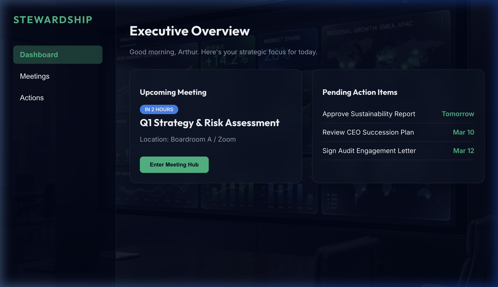
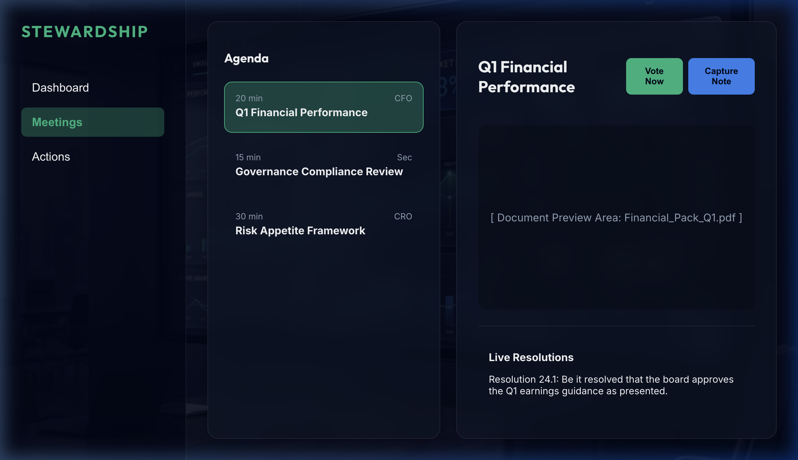
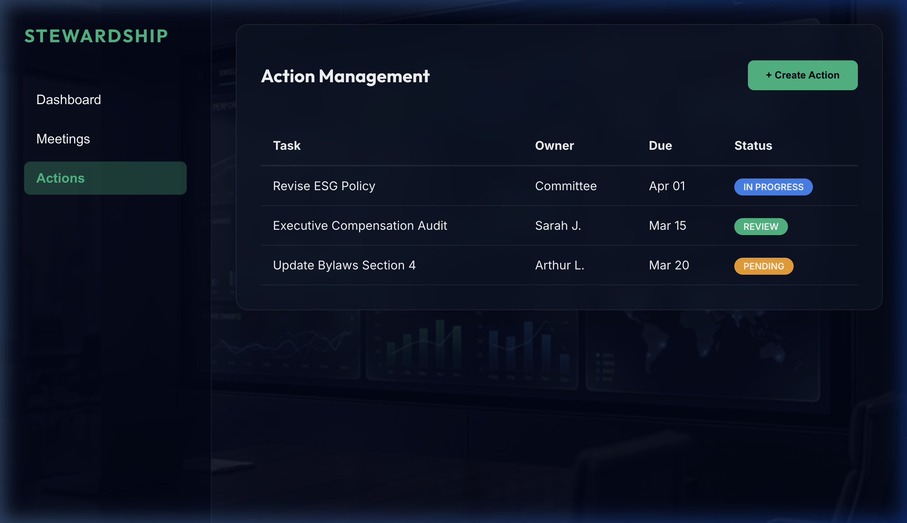
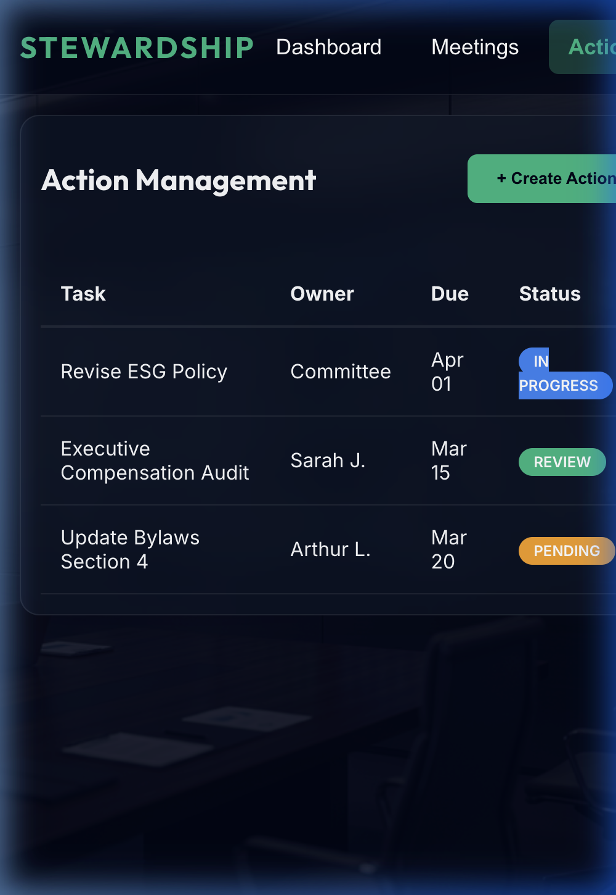

# UX Case Study: Redesigning for Executive Efficiency

## 1. Problem Statement
Board members are overwhelmed by massive "Board Packs" (300+ page PDFs) and fragmented post-meeting action tracking. This leads to cognitive overload, inefficient meetings, and delayed strategic execution.

## 2. Research & Discovery
- **Competitive Analysis**: Tools like Diligent and OnBoard are secure but suffer from dated, complex interfaces.
- **Pain Points**: Information "black holes," disconnected voting, and poor mobile usability.
- **Personas**: [Arthur (The Strategist)](file:///Users/mary/.gemini/antigravity/brain/a2174e88-db03-4726-aace-c07898d4299b/research_notes.md#L15) and [Sarah (The Organizer)](file:///Users/mary/.gemini/antigravity/brain/a2174e88-db03-4726-aace-c07898d4299b/research_notes.md#L21).

## 3. The Solution: "Stewardship" Platform
A redesigned hub focusing on **Actionable Intelligence** rather than just document storage.

### High-Fidelity Design Showcase
````carousel

<!-- slide -->

<!-- slide -->

<!-- slide -->

````

## 4. Key Design Features
1. **Glass-Card UI**: Reduces visual weight while maintaining a premium "Executive" feel.
2. **Inline Decision Tools**: Voting and note-taking are integrated directly into the agenda/document view.
3. **Outcome Visibility**: The Action Management system provides real-time progress tracking, bridging the gap between meetings.

## 5. Metrics & Verification
- **Success Metrics (Hypothetical)**: 
  - 40% reduction in document retrieval time.
  - 25% increase in action item completion rate.
- **Verification**: The interactive prototype was tested for structural integrity and responsive behavior across viewports.

## 6. Final Reflection
The redesign shifts the focus from "Management" to "Stewardship." By reducing friction in the document-to-action pipeline, executives can focus on strategic outcomes rather than administrative overhead.
